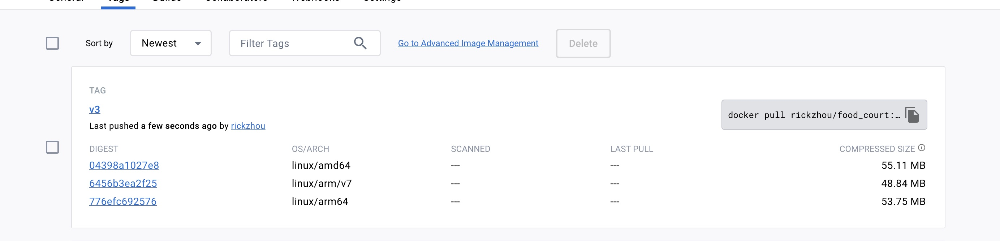

# Common Commands
``bash
# copy file from container to local
$ docker cp container-id:/path/filename.txt ~/Desktop/filename.txt

```


# 1. Docker build an image and push to dockerhub

## 1.1 Action-2 my customized food court

```bash
# https://www.stacksimplify.com/aws-eks/docker-basics/build-docker-image/

# 0. ssh to my gcp instance
$ ssh -i ~/.ssh/ricky-go runzhou@34.72.177.103


# 0. display the run command that used before
# $ docker inspect -f '{{ .Config.Env}} {{ .Config.Entrypoint}} {{ .Config.Cmd}} {{ .VolumesFrom}} {{.Volumes}}  {{ .HostConfig.links}}' nginx_web
$ docker inspect -f '{{ .Config.Env}} {{ .Config.Entrypoint}} {{ .Config.Cmd}}' nginx_web


# 2. create Dockerfile
FROM nginx
COPY . /usr/share/nginx/html


# 3. build docker image & run it
# https://hub.docker.com/settings/general
$ docker build -t rickzhou/food_court:v1 .
# $ docker build -t something:latest -f ./DockerFile .
$ docker run --name foodcourt_container -p 80:80 -d rickzhou/food_court:v1


# 4. Tag & push the Docker image to docker hub
$ docker tag rickzhou/food_court:v1 rickzhou/food_court:v1-release
$ docker push rickzhou/food_court:v1-release


# use same tag, it will overwrite
# use different tag, it will stack on the top
$ docker tag rickzhou/food_court:v1 rickzhou/food_court:v2-release
$ docker push rickzhou/food_court:v2-release

# 5. verify the same in dockerhub
https://hub.docker.com/repositories

```


<br><br><br><br><br><br>

## 1.2 Action-2 random nginx customized image

```bash
# 1. run the nginx base container
$ docker run --name nginx_test_container -p 80:80 -d nginx
# localhost to test
$ docker ps -a
>> loalhost

$ docker stop nginx_test_container


# 2. create docker file
FROM nginx
COPY index.html /usr/share/nginx/html

# index.html
<!DOCTYPE html>
<html>
   <body style="background-color:lightgoldenrodyellow;">
      <h1>Welcome to Stack Simplify</h1>
      <p>Docker for Beginners Demo</p>
      <p>Application Version: V1</p>
   </body>
</html>


# 3. build docker file
# https://hub.docker.com/settings/general
$ docker build -t rickzhou/food_court:v1 .
$ docker run --name foodcourt_container -p 80:80 -d rickzhou/food_court:v1

#  check if your port occupied
$ lsof -i -P -n | grep LISTEN


# 4. Tag & push the Docker image to docker hub
$ docker tag rickzhou/food_court:v1 rickzhou/food_court:v1-release
$ docker push rickzhou/food_court:v1-release

# 5. verify the same in dockerhub
https://hub.docker.com/repositories

```

<br><br><br><br><br><br>

## 1.3 Face arch issue in gcp instance

```log
➜  nginx docker logs -f foodcourt_container
exec /docker-entrypoint.sh: exec format error
```

```bash
# 1. check linux arch
$ uname -m
>> x86_64

# check arch on mac
$ uname -m
>> arm64


# https://docs.docker.com/build/building/multi-platform/

# $ docker buildx build --platform linux/amd64,linux/arm64,linux/arm/v7 -t rickzhou/food_court:v3  .
$ docker buildx build --platform linux/amd64,linux/arm64,linux/arm/v7 -t rickzhou/food_court:v3 --push .

# facing issue
➜  build docker buildx build --platform linux/amd64,linux/arm64,linux/arm/v7 -t rickzhou/food_court:v3 .
[+] Building 0.0s (0/0)
ERROR: multiple platforms feature is currently not supported for docker driver. Please switch to a different driver (eg. "docker buildx create --use")


# switch to different dirver
$ docker buildx create --use
$ docker buildx build --platform linux/amd64,linux/arm64,linux/arm/v7 -t rickzhou/food_court:v3 --push .
>> successful

```



<br><br><br><br><br><br>

```bash
# https://hub.docker.com/repository/docker/rickzhou/food_court/tags?page=1&ordering=last_updated
$ docker pull rickzhou/food_court:v3
$ docker run --name foodcourt_container -p 80:80 -d rickzhou/food_court:v3

```
